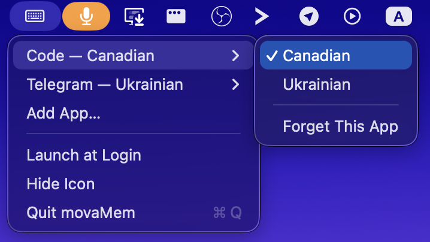

# movaMem

Per-application keyboard layout memory for macOS.

macOS has one global keyboard layout, so working across apps in different languages means
switching it by hand every time focus changes. movaMem remembers the layout you deliberately
chose in each application and restores it when you come back.

Type English in VS Code, Ukrainian in Slack, French in Telegram. Switch between them and the
layout follows.



## What it does

- **Learns by watching.** Switch layout while in an app and movaMem remembers it for that app.
  Nothing is recorded until you make a real choice, so the list only ever contains decisions you
  actually made.
- **Restores automatically** when you return to an app.
- **Set a layout by hand** from any app's submenu, with a checkmark on the current one.
- **Forget an app** to stop managing it.
- **Add an app you have never opened** via `Add App…`, including one that is not running. It
  starts as `(not set)` and does nothing until you pick a layout.
- **Hide the menu bar icon** if you want it out of the way. The app keeps working; relaunching
  brings the icon back.
- **Launch at login**, off by default.

### Requires no permissions

movaMem detects layout changes through a system notification rather than by watching your
keystrokes. It never appears in Accessibility or Input Monitoring, and macOS shows no permission
prompt. It catches every way of switching — the ⌘Space-style shortcut, Caps Lock, and the system
input menu.

### Stays out of the way

Around 20 MB of memory and no measurable CPU while idle. There is a deliberate ~300 ms delay
before it switches on app activation, which is what stops Spotlight, notification banners, and
permission dialogs from polluting your saved layouts.

## Install

Requires macOS 14 or later.

### With Homebrew

```bash
brew tap melnychenkoca/movamem
brew trust --cask melnychenkoca/movamem/movamem
brew install --cask movamem
xattr -dr com.apple.quarantine /Applications/movaMem.app
open /Applications/movaMem.app
```

Four steps, because movaMem is built without an Apple Developer ID. Each one clears a different
gate:

**`brew trust`** — Homebrew 5 refuses to load casks from third-party taps until you trust them
explicitly. Without it the install stops before downloading anything.

**`xattr -dr com.apple.quarantine`** — Homebrew marks downloads as quarantined, and macOS refuses
to launch a quarantined app that is not notarized, calling it *"damaged and can't be opened"*.
The app is not damaged; that is just the message macOS uses. Removing the attribute clears it.

Note this is what the old `brew install --no-quarantine` flag used to do. That flag was removed in
Homebrew 5, so any instructions that still mention it will fail with `invalid option`.

If you would rather not strip the attribute, skip that step and approve the app once instead: try
to open it, let macOS block it, then go to System Settings → Privacy & Security and click
**Open Anyway**. On macOS 15 and later this is the only manual route — Apple removed the old
Control-click → Open bypass.

### From source

Needs Swift 6. Full Xcode is **not** required — the Command Line Tools are enough.

```bash
git clone git@github.com:melnychenkoca/movaMem.git
cd movaMem
make install
open /Applications/movaMem.app
```

A keyboard glyph appears at the right of the menu bar. There is no Dock icon and no window — it
is a menu bar app only.

To start using it, go to an app, switch to the layout you want there, and repeat for a couple of
apps. Then switch between them.

## Uninstall

If you installed with Homebrew:

```bash
brew uninstall --cask movamem          # keeps your remembered layouts
brew uninstall --zap --cask movamem    # removes them too
```

If you installed from source:

```bash
# Quit from the menu first, then:
rm -rf /Applications/movaMem.app
rm -rf ~/Library/Application\ Support/movaMem
```

## Commands

| Command | What it does |
|---|---|
| `make` | Build and assemble `movaMem.app` in the project directory |
| `make install` | Build, assemble, and copy to `/Applications` |
| `make test` | Run the test suite (58 tests) |
| `make build` | Compile only, no bundle |
| `make clean` | Remove build artifacts and the bundle |
| `make sign-setup` | Print one-time steps for a stable code signature (optional) |
| `make dist` | Build the universal release zip and print its SHA256 |

`make dist` is what CI runs on a version tag. It cross-compiles both architectures and joins them
with `lipo`, because `swift build --arch arm64 --arch x86_64` routes through Xcode's build system
and fails under Command Line Tools alone.

The app is ad-hoc signed by default, which is fine for personal use. `make sign-setup` explains
how to create a self-signed certificate if you want a stable identity across rebuilds.

## Where your data lives

```bash
cat ~/Library/Application\ Support/movaMem/layouts.json
```

```json
{
  "apps" : {
    "com.microsoft.VSCode" : "com.apple.keylayout.Canadian",
    "com.tinyspeck.slackmacgap" : null,
    "ru.keepcoder.Telegram" : "com.apple.keylayout.Ukrainian-PC"
  },
  "version" : 2
}
```

Plain JSON, pretty-printed, safe to read or edit by hand. Apps are keyed by bundle identifier so
your preferences survive renaming or moving an app. A `null` means the app is managed but has no
layout chosen yet.

If the file is ever unreadable or malformed, movaMem renames it aside as
`layouts.json.corrupt-<timestamp>` and starts fresh rather than overwriting it — your data is
never silently destroyed.

## How it works

Two sources of OS events feed one decision-maker, which reads and writes the JSON store.

```
NSWorkspace ──"VS Code activated"──┐
                                   ├──► SwitchCoordinator ──► LayoutStore (layouts.json)
Carbon TIS ──"layout → Ukrainian"──┘           │
                                               └──────────► InputSourceService (select)
```

| File | Responsibility |
|---|---|
| `InputSourceService` | The only code that touches Carbon's Text Input Sources API |
| `AppMonitor` | The only code that touches `NSWorkspace`, including the 300 ms dwell filter |
| `LayoutStore` | The JSON store, with atomic writes and corrupt-file quarantine |
| `SwitchCoordinator` | All the policy — what to restore, what to record |
| `MenuController` | The menu bar item and its menus |
| `AppPicker` | Decides whether a chosen app can be managed |
| `main.swift` | Wires the pieces together; no logic of its own |

The two OS wrappers sit behind protocols, so the policy layer is tested against fakes with no OS
involvement. That is why the interesting rules — record only deliberate changes, ignore transient
focus, never learn from our own switching — are covered by fast unit tests rather than by clicking
around.

### Design notes

Two decisions worth knowing about, both driven by measured behavior rather than assumption:

**Suppression stores a layout ID, not a flag.** movaMem must ignore the layout-change notification
caused by its own switching. The obvious approach is a boolean, and it is wrong: selecting an
already-active layout fires zero notifications, while one selection sometimes delivers two. A flag
breaks on both, intermittently. Storing *which* layout we selected is immune to both.

**Availability comes from the OS, every time the menu opens.** A layout you uninstall shows as
`(unavailable)` and dimmed, and returns to normal when you reinstall it — with no stale cached
state in between.

## Releasing

`Resources/Info.plist` holds the version. Releasing is bumping it and tagging to match:

```bash
# 1. Bump CFBundleShortVersionString in Resources/Info.plist, e.g. to 1.1.0
git commit -am "Version 1.1.0"
git push

# 2. Tag it
git tag v1.1.0
git push origin v1.1.0
```

[`.github/workflows/release.yml`](.github/workflows/release.yml) then runs the tests, builds the
universal bundle, verifies the asset really is universal and correctly signed, publishes
`movaMem.zip` to the GitHub release, and updates the Homebrew cask.

The tag and `CFBundleShortVersionString` **must** match, and the workflow fails if they do not.
Without that check a tag can ship an app reporting a different version than Homebrew recorded,
which makes `brew upgrade` misjudge what is current.

### Cask updates

The workflow pushes the new `version` and `sha256` to the
[tap repository](https://github.com/melnychenkoca/homebrew-movamem) automatically. This needs a
token, because the default `GITHUB_TOKEN` can only write to this repository:

1. Create a [fine-grained personal access token](https://github.com/settings/personal-access-tokens/new)
   scoped to **only** `melnychenkoca/homebrew-movamem`, with **Repository permissions →
   Contents → Read and write**
2. Add it to this repository as a secret named `TAP_TOKEN`
   (Settings → Secrets and variables → Actions → New repository secret)

Without the secret the release still succeeds — the tap steps skip, and the workflow log prints
the `sha256` to paste into the cask by hand.

### Automating the tag too

Tags are deliberately manual: a release should be an explicit act, and the first few are worth
watching. If that becomes tedious, the natural next step is a small workflow that tags whenever
`CFBundleShortVersionString` changes on `main` — keeping the plist as the single trigger rather
than introducing commit-message conventions. Worth adding only once the pipeline has proven
itself over a few manual releases.

## Development

Docs live under [docs/superpowers/](docs/superpowers/): design specs, implementation plans, and a
manual verification checklist for the parts that need a human (menu appearance, real app switching,
launch at login across a reboot).

Code style is deliberately plain rather than idiomatic: explicit loops over chained
`map`/`filter`, named intermediate values, no force-unwraps, and comments that explain *why*. The
project is reviewed by someone who does not write Swift, so readability beats brevity.

Around 1,300 lines of Swift across 9 files, no third-party dependencies.
